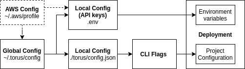

# Torus Config
In order to provide a seamless experience and eliminate any barriers to entry, the torus CLI was designed to be self-configurating. To maintain and reuse a similar configuration in our other projects we made this configuration SDK.

## Features
- Helps automate global as well as project configuration for all of the torus tools.
- Lets you control your configuration settings, as well as your API keys, at a global and also a per-project basis.
- Guides you through the necessary steps to generate the API keys for all of the different supported providers.

## How it works
The global configuration file sotred in `~/.aws/config` holds the standard environment variables that the user intends to use on most of their projects. the global config file uses a simple toml format and it includes both the API keys/env variables for each cloud/domain provider as well as the providers configuration that sets which provider should be used for which resource. The codeblock bellow shows a sample gloabl config file for a user that usually deploys sites with a Godaddy domain, AWS Bucket, AWS route53 DNS, AWS Cloudfront CDN, and AWS ACM Certificate. Notice that for the aws provider we dont have to provide API keys as we can reference the AWS config in `~/.aws/credentials`. If you dont have a global AWS config you can also provide the API keys directly as `access_key_id` and `secret_access_key`.

    [aws]
    region=us-east-1
    profile=default
    
    [godaddy]
    api_key=fe98wkf287e927198dnj87589hjspi
    secret_key=iufyewuiyf8746r98370
    
    [providers]
    domain=godaddy
    bucket=aws
    cdn=aws
    dns=aws
    https=aws

The diagram bellow represents the flow of configuration variables.

## Torus_config JSON file

every project will have a torus config file that will contain the default providers for that project. You may modify this config file manually at any time or on a per-instance basis by providing CLI flags

    const config = {
      index:"index.html",
      error:"error.html",
      last_deployment:"",
      providers: {
        domain: 'godaddy',
        bucket: 'aws',
        cdn: 'aws',
        dns: 'aws',
        https: 'aws'
      }
    }

